# Memory Capture AI — System Architecture

A voice-driven AI life-story capture application. The user speaks; the AI listens, asks follow-up questions, extracts memories, and generates watercolor illustrations — all orchestrated across Azure's AI and data services.

```mermaid
flowchart TB

  %% ── LAYER 0: USER ──────────────────────────────────────────────────
  subgraph USER["👤 Storyteller / Visitor"]
    direction LR
    HUMAN["Human Speaker\n(microphone + browser)"]
  end

  %% ── LAYER 1: BROWSER / REACT SPA ───────────────────────────────────
  subgraph BROWSER["🌐 Browser — React 18 SPA (Vite + TypeScript)"]
    direction TB

    subgraph SCREENS["Screens"]
      direction LR
      S1["Onboarding\n/onboarding"]
      S2["Home\n/home"]
      S3["Interview\n/interview ★"]
      S4["Summary\n/summary"]
      S5["Profiles\n/profiles"]
      S6["Memory Detail\n/memories/:id"]
      S7["Admin\n/admin"]
    end

    subgraph STATE["Global State"]
      STORE["StoreProvider\nprofiles · activeProfile\nmemories · sessions"]
      AUTH["AuthProvider\nguest | GitHub OAuth\n/.auth/me"]
    end

    subgraph SPEECH_CLIENT["Azure Speech SDK (lazy, browser)"]
      STT["Speech-to-Text\ncontinuous recognition\nonInterim / onFinal"]
      TTS["Text-to-Speech\npersona voice\nauto-restart mic"]
    end

    subgraph ENGINE["Interview Engine"]
      HTTP_ENG["HttpInterviewEngine\n(VITE_AI_MODE=azure)"]
      FALLBACK["FallbackInterviewEngine\noffline · regex · pools"]
      HTTP_ENG -- "timeout / error" --> FALLBACK
    end

  end

  HUMAN -- "voice" --> STT
  TTS -- "audio playback" --> HUMAN
  S3 --> STT
  S3 --> TTS
  S3 --> ENGINE
  S3 --> STORE

  %% ── LAYER 2: AZURE STATIC WEB APPS ─────────────────────────────────
  subgraph SWA["☁️ Azure Static Web Apps — jolly-moss-08debec00"]
    direction TB
    CDN["CDN Edge\nServes Vite SPA bundle"]
    EDGE_AUTH["Built-in Auth\nGitHub OAuth\n/.auth/login/github\n/.auth/me · /.auth/logout"]
    ROUTE_RULES["Route Rules\n/api/profiles → authenticated only\n/api/uploads → authenticated only\n/api/* → open"]
    CICD["CI/CD\nGitHub Actions → npm build → deploy\non every push to main"]
  end

  BROWSER -- "HTTPS" --> SWA
  CICD -- "deploys" --> CDN

  %% ── LAYER 3: AZURE FUNCTIONS v4 (TypeScript) ───────────────────────
  subgraph FUNCTIONS["⚡ Azure Functions v4 — TypeScript (managed by SWA)"]
    direction TB

    subgraph PROFILE_FN["Profile Management"]
      FN_PROFILES["profiles.ts\nGET /api/profiles\nPOST /api/profiles"]
      FN_PROFILE_ID["profile-by-id.ts\nGET /api/profiles/:id\nPATCH /api/profiles/:id\nDELETE /api/profiles/:id"]
    end

    subgraph INTERVIEW_FN["Interview AI"]
      FN_EXTRACT["extract.ts\nPOST /api/interview/extract\nTitle · Era · Theme · Excerpt\nPeople · Places · Years · Summary"]
      FN_NEXT_Q["next-question.ts\nPOST /api/interview/next-question\nStreaming plain-text response"]
      FN_SUGGEST["suggest-questions.ts\nPOST /api/interview/suggest-questions\n3 follow-up options (manual mode)"]
      FN_SUMMARY["summary.ts\nPOST /api/interview/summary\nSession reflection paragraph"]
    end

    subgraph MEDIA_FN["Media"]
      FN_ILLUSTRATE["illustrate.ts\nPOST /api/memories/illustrate\nWatercolor image generation"]
      FN_PHOTO["upload-photo.ts\nPOST /api/uploads/photo\nProfile photo → Blob"]
    end

    subgraph SPEECH_FN["Speech"]
      FN_SPEECH["speech-token.ts\nGET /api/speech/token\nMint 10-min JWT for Speech SDK"]
    end

  end

  SWA -- "routes /api/*" --> FUNCTIONS
  ROUTE_RULES --> PROFILE_FN
  EDGE_AUTH -- "x-ms-client-principal header" --> PROFILE_FN

  %% ── LAYER 4: AZURE DATA SERVICES ────────────────────────────────────
  subgraph DATA["🗄️ Azure Data Services"]
    direction LR

    subgraph COSMOS["Azure Cosmos DB\nmemorycapture database"]
      COL_PROFILES["profiles container\npartition key: /accountId\nStorytellerProfile docs\n+ nested Memory arrays"]
    end

    subgraph BLOB["Azure Blob Storage\nmemorycapturestore"]
      BLOB_PHOTOS["profile-photos/\nuser-uploaded photos"]
      BLOB_ART["memory-art/\nAI-generated illustrations"]
    end

  end

  PROFILE_FN --> COL_PROFILES
  FN_PHOTO --> BLOB_PHOTOS
  FN_ILLUSTRATE --> BLOB_ART

  %% ── LAYER 5: AZURE AI SERVICES ──────────────────────────────────────
  subgraph AI["🤖 Azure AI Services"]
    direction TB

    subgraph OPENAI_CHAT["Azure OpenAI — gpt-4o-mini\ncarlovinci17-7226-resource"]
      OAI_EXTRACT["Memory Extraction\nStructured JSON output\ntitle · era · theme · people · places · years"]
      OAI_NEXT_Q["Question Generation\nContext-aware follow-up\nstreamed token by token"]
      OAI_SUGGEST["Question Suggestions\n3 alternatives for manual mode"]
      OAI_SUMMARY["Session Summary\nWarm narrative reflection"]
    end

    subgraph OPENAI_IMAGE["Azure OpenAI — gpt-image-1\nmem-app-gpt-image-1-mini"]
      OAI_IMAGE["Watercolor Illustration\nPrompt: memory title + theme + era\nOutput: 1024×1024 PNG → Blob URL"]
    end

    subgraph SPEECH_SVC["Azure AI Speech — australiaeast"]
      SPEECH_TOKEN_SVC["Token Endpoint\n10-min auth token\nfor browser SDK"]
      SPEECH_STT["Speech-to-Text\nContinuous recognition\nReal-time interim results"]
      SPEECH_TTS["Text-to-Speech\nMultiple persona voices\nNeural voices"]
    end

  end

  FN_EXTRACT --> OAI_EXTRACT
  FN_NEXT_Q --> OAI_NEXT_Q
  FN_SUGGEST --> OAI_SUGGEST
  FN_SUMMARY --> OAI_SUMMARY
  FN_ILLUSTRATE --> OAI_IMAGE
  OAI_IMAGE --> BLOB_ART
  FN_SPEECH --> SPEECH_TOKEN_SVC
  SPEECH_TOKEN_SVC --> STT
  SPEECH_TOKEN_SVC --> TTS
  STT --> SPEECH_STT
  TTS --> SPEECH_TTS

  %% ── LAYER 6: EXTERNAL SERVICES ──────────────────────────────────────
  subgraph EXTERNAL["🔗 External Services"]
    GITHUB["GitHub\nOAuth provider\nSource repo\nGitHub Actions CI/CD"]
  end

  EDGE_AUTH --> GITHUB
  GITHUB --> CICD

  %% ── KEY DATA FLOWS ───────────────────────────────────────────────────
  subgraph FLOWS["🔄 Key Data Flows"]
    direction LR
    F1["① Voice Interview Loop\nMic → STT → answer text\n→ extract (gpt-4o-mini)\n→ Memory card created\n→ illustrate (gpt-image-1)\n→ Blob URL → card updated"]
    F2["② AI Question Flow\nExtraction complete\n→ next-question (gpt-4o-mini, streaming)\n→ question rendered\n→ TTS speaks aloud\n→ mic auto-restarts"]
    F3["③ Profile Persistence\nStoreProvider mutation\n→ /api/profiles (production)\nor localStorage (demo mode)"]
    F4["④ Auth Flow (production)\nAdmin panel\n→ /.auth/login/github\n→ GitHub OAuth\n→ x-ms-client-principal injected\n→ Functions accept request"]
  end

  %% ── STYLING ──────────────────────────────────────────────────────────
  classDef azure fill:#0078D4,stroke:#005a9e,color:#fff
  classDef ai fill:#6B2FAA,stroke:#4a1f7a,color:#fff
  classDef data fill:#00796B,stroke:#004D40,color:#fff
  classDef browser fill:#1565C0,stroke:#0D47A1,color:#fff
  classDef external fill:#37474F,stroke:#263238,color:#fff
  classDef flow fill:#E65100,stroke:#BF360C,color:#fff
  classDef highlight fill:#F57F17,stroke:#E65100,color:#000

  class CDN,EDGE_AUTH,ROUTE_RULES,CICD azure
  class FN_PROFILES,FN_PROFILE_ID,FN_EXTRACT,FN_NEXT_Q,FN_SUGGEST,FN_SUMMARY,FN_ILLUSTRATE,FN_PHOTO,FN_SPEECH azure
  class OAI_EXTRACT,OAI_NEXT_Q,OAI_SUGGEST,OAI_SUMMARY,OAI_IMAGE,SPEECH_TOKEN_SVC,SPEECH_STT,SPEECH_TTS ai
  class COL_PROFILES,BLOB_PHOTOS,BLOB_ART data
  class STORE,AUTH,STT,TTS,HTTP_ENG,FALLBACK,ENGINE browser
  class GITHUB external
  class F1,F2,F3,F4 flow
  class S3 highlight
```

---

## Service Inventory

| Layer | Service | Purpose |
|---|---|---|
| Frontend | React 18 + Vite + TypeScript | SPA — 8 screens, React Router v6 |
| Frontend | Azure Speech SDK (browser) | STT continuous recognition + TTS playback |
| Hosting | Azure Static Web Apps | CDN hosting + managed Functions + built-in auth |
| Auth | GitHub OAuth (via SWA) | Owner authentication for production mode |
| CI/CD | GitHub Actions | Lint → typecheck → test → build → deploy |
| Functions | Azure Functions v4 TypeScript | 9 API endpoints (profiles, AI, media, speech) |
| Database | Azure Cosmos DB | Profiles + memories (NoSQL, partitioned by account) |
| Storage | Azure Blob Storage | Profile photos + AI-generated illustrations |
| AI — Chat | Azure OpenAI gpt-4o-mini | Question generation, memory extraction, summaries |
| AI — Image | Azure OpenAI gpt-image-1 | Watercolor illustration per captured memory |
| AI — Speech | Azure AI Speech (australiaeast) | STT from microphone + TTS persona voices |
